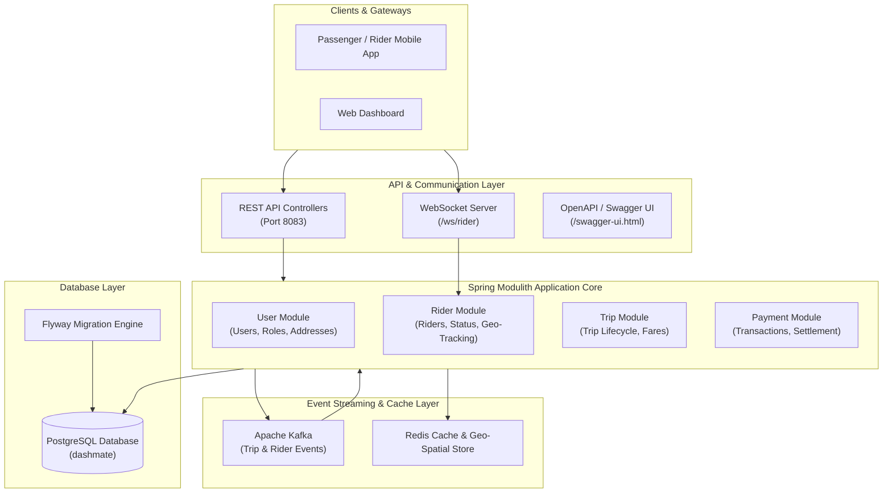

# 🚗 Dashmate - Event-Driven Ride-Hailing & Logistics Platform

[](https://spring.io/projects/spring-boot)
[](https://spring.io/projects/spring-modulith)
[](https://www.oracle.com/java/)
[](https://kafka.apache.org/)
[](https://redis.io/)
[](https://www.postgresql.org/)
[](https://flywaydb.org/)

**Dashmate Event-Driven** (SmartBite Store) is a scalable, modular event-driven backend service built with **Spring Boot 3** and **Spring Modulith**. It handles core ride-hailing and logistics workflows including real-time rider tracking, dynamic fare calculation, event-driven trip lifecycle management, and instant payment settlement using **Apache Kafka**, **Redis**, and **WebSockets**.

---

## 🏛️ Architecture Overview

The system follows the **Spring Modulith (Modular Monolith)** architectural pattern, isolating business domains while leveraging **Apache Kafka** for asynchronous messaging and **Redis** for geospatial caching and session management.



---

## ✨ Key Features

- 🏗️ **Spring Modulith Encapsulation**: Strict package boundaries (`publicApi` vs `internalModule`) ensuring high maintainability and decoupled domain boundaries.
- ⚡ **Asynchronous Event-Driven Engine**: Kafka-based producers and consumers for trip creation (`TripCreateEvent`), trip assignment (`TripAssignEvent`), trip cancellation (`CancelTripEvent`), and payment processing (`CreatePaymentEvent`).
- 📍 **Real-Time Rider Geo-Tracking**: Spatial location updates via Redis and live bidirectional notifications over WebSockets (`/ws/rider`).
- 💵 **Dynamic Weather & Surge Fare Calculation**: Automated fare estimates integrating distance matrix calculations and weather condition adjustments (`WeatherChecker` & `ChargeCalculation`).
- 🛡️ **WebSocket Authentication**: Custom WebSocket handshake interceptor (`WebSocketAuthInterceptor`) ensuring secure real-time rider connections.
- 🗄️ **Versioned Database Migrations**: Automated PostgreSQL database evolution managed by **Flyway**.
- 📊 **Production Observability**: Integrated **Spring Boot Actuator** exposing health, info, metrics, and Prometheus monitoring endpoints.

---

## 📦 Domain Modules Breakdown

| Module | Package | Description |
| :--- | :--- | :--- |
| **User Module** | `user_modul` | Handles customer & rider registration, profile updates, status toggling (Active/Inactive), addresses, and user device registrations. |
| **Rider Module** | `rider_modul` | Manages driver profiles, availability state, real-time geolocation updates, and WebSocket session dispatching. |
| **Trip Module** | `trip_modul` | Coordinates ride requests, fare estimations, trip assignment logic, trip stop updates, and trip cancellations. |
| **Payment Module** | `payment_modul` | Manages payment transaction records, payment statuses, and fare settlements. |
| **Kafka Module** | `kafaka` | Configures Kafka producers/consumers, topics, and handles asynchronous domain event propagation. |
| **Redis Module** | `redis` | Provides Redis client templates for location caching and active rider sessions. |
| **Helper Service** | `helper_service` | Business logic services for weather evaluation, distance calculation, and surge price multipliers. |

---

## 🛠️ Technology Stack

- **Framework**: Spring Boot 3.3.4, Spring Modulith 1.2.7
- **Languages**: Java 17, Kotlin
- **Database**: PostgreSQL
- **Migration Tool**: Flyway
- **Event Streaming**: Apache Kafka
- **In-Memory Store / Cache**: Redis
- **Real-Time Messaging**: WebSockets (Spring WebSocket)
- **API Documentation**: Springdoc OpenAPI / Swagger UI
- **Build Tool**: Apache Maven (`mvnw`)
- **Containerization**: Docker & Docker Compose

---

## ⚙️ Configuration & Environment

The application configuration is specified in [`src/main/resources/application.yml`](file:///Volumes/Project/store/src/main/resources/application.yml).

Key Configuration Parameters:

```yaml
server:
  port: 8083

spring:
  datasource:
    url: jdbc:postgresql://localhost:5432/dashmate
    username: postgres
    password: root
  data:
    redis:
      host:  # Configure your Redis host
      port: 6379
  kafka:
    bootstrap-servers:  # Configure your Kafka broker
    consumer:
      group-id: order-service
  flyway:
    enabled: true
    locations: classpath:db/migration
```

---

## 🗃️ Database Migrations (Flyway)

The PostgreSQL database schema is versioned using Flyway migration scripts located in [`src/main/resources/db/migration`](file:///Volumes/Project/store/src/main/resources/db/migration):

- `V1__create_users.sql` - User master table
- `V2__create_products.sql` - Product definitions
- `V3__create_orders.sql` - Initial order schema
- `V4__create_address.sql` - User address mapping
- `V5__create_user_device.sql` - Mobile device tokens & push notification details
- `V6__create_order.sql` - Order & trip details schema
- `V7__create_trip_assignment.sql` - Rider trip assignments
- `V8__Altertable_Riders.sql` - Rider status & vehicle parameters
- `V9__Role_added_user.sql` - User role management
- `V10__Alter_table_tripstop.sql` - Trip intermediate stops
- `V11__payment_id_add_to_payment_table.sql` - Payment reference mappings

---

## 🚀 Getting Started

### Prerequisites

Ensure you have the following installed on your system:
- **Java 17 JDK** or higher
- **Docker** & **Docker Compose**
- **PostgreSQL 14+**
- **Apache Kafka** & **Redis**

### Running with Docker Compose

You can build and launch the application container using Docker Compose:

```bash
# Build and start services
docker compose up --build
```

### Running Locally with Maven

1. **Start PostgreSQL, Kafka, and Redis services** (or update `application.yml` with your local IP addresses).
2. **Compile and run the Spring Boot application**:

```bash
# Using the Maven Wrapper
./mvnw spring-boot:run
```

The application will start on **port `8083`**.

---

## 🔌 API Endpoints & Real-Time Documentation

### Interactive Swagger UI
Once running, explore and test the REST APIs via Swagger UI:
👉 `http://localhost:8083/swagger-ui.html`

### Primary REST Endpoints

#### 👤 User Management (`UserController`)
- `POST /create-user` - Register a new user profile
- `POST /create-userAddress?userId={id}` - Add user delivery/pickup address
- `GET /get-user?email={email}` - Fetch user details by email
- `PUT /upate-user` - Update profile information
- `GET /get-user-status{email}` - Check user account status
- `PUT /update-user-status-to-activate` - Activate user account
- `PUT /update-user-status-to-inactive` - Deactivate user account

#### 🏍️ Rider Operations (`RiderController`)
- `POST /create-rider-profile` - Register a driver/rider profile
- `POST /mark-rider-available` - Set rider status to Active/Available
- `POST /rider/update-loaction/{riderId}?latitude={lat}&longitude={lng}` - Update real-time GPS coordinates

#### 🚕 Trip Operations (`TripController`)
- `POST /calculate-fare-estimate` - Calculate ride fare estimate (incorporating weather and distance)
- `POST /create-trip` - Dispatch and request a new trip
- `POST /cancle-trip` - Cancel an active trip request

#### 📡 Real-Time WebSockets
- **WebSocket Endpoint**: `ws://localhost:8083/ws/rider`
- **Interceptor**: Authenticates handshake requests before establishing live rider data channels.

---

## 📊 Monitoring & Health Checks

Spring Boot Actuator endpoints are exposed for system health monitoring:

- **Health Check**: `http://localhost:8083/actuator/health`
- **Info**: `http://localhost:8083/actuator/info`
- **Prometheus Metrics**: `http://localhost:8083/actuator/prometheus`

---

## 📄 License

This project is proprietary software developed under the **SmartBite / Dashmate Platform**.
